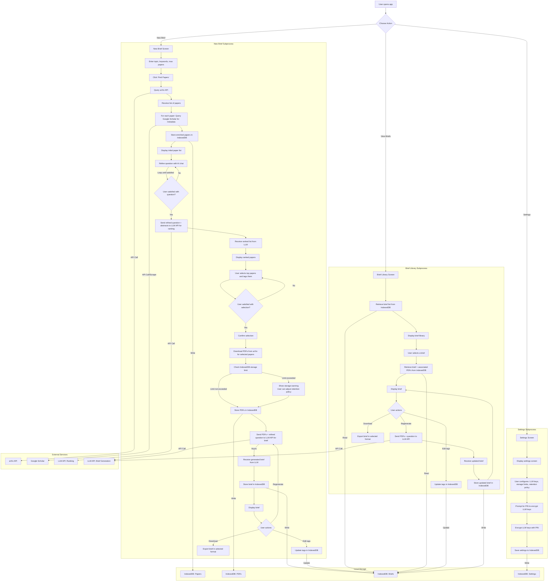

# Full Application Workflow

## Mermaid Diagram

## Overview

The application provides a research paper management and brief generation system with three main components:

### Core Components

1. **New Brief Creation**
   - AI-assisted research question refinement
   - Automated paper discovery and ranking
   - PDF management and brief generation

2. **Brief Library**
   - Brief storage and management
   - PDF reuse across briefs
   - Tag-based organization

3. **Settings Management**
   - API key configuration
   - Storage management
   - Security settings

### External Integrations

- **arXiv API**: Paper discovery and PDF retrieval
- **Google Scholar**: Metadata enrichment
- **LLM API**: Question refinement and brief generation

### Data Storage

All data is persisted in IndexedDB:

- Papers and metadata
- PDF documents
- Generated briefs
- Application settings

## Detailed Workflows

### 1. New Brief Creation

#### Initial Setup

1. User provides:
   - Research topic
   - Keywords
   - Paper limit (e.g., 100 papers)

#### Paper Discovery

1. **API Queries**
   - Query arXiv API with user parameters
   - Enrich results with Google Scholar metadata
   - Store papers in IndexedDB

2. **Question Refinement**
   - Interactive AI chat interface
   - Iterative refinement process
   - Question optimization

3. **Paper Ranking**
   - Submit to LLM API:
     - Refined research question
     - Paper abstracts
   - Present ranked results to user

#### Content Management

1. **Paper Selection**
   - User reviews ranked papers
   - Applies tags for organization
   - Confirms final selection

2. **PDF Processing**
   - Download PDFs from arXiv
   - Storage limit verification
   - User prompts if storage exceeded

#### Brief Generation

1. **LLM Processing**
   - Submit to API:
     - Selected PDFs
     - Refined question
   - Asynchronous generation

2. **User Interaction**
   - Edit brief tags
   - Regenerate if needed
   - Download options

### 2. Brief Library Management

#### Features

- Complete brief listing
- Search and filter capabilities
- Tag-based organization

#### Actions

- View briefs
- Edit metadata
- Regenerate briefs
- Download in various formats

### 3. Settings Management

#### Security

- LLM API key management
- PIN-based encryption
- Access control

#### Storage

- Quota management
- Retention policies
- Cleanup tools

#### Configuration

- Default parameters
- API preferences
- UI customization

## Technical Features

### Process Control

- **Iterative Loops**
  - Question refinement
  - Paper selection
  - Brief generation

### Resource Management

- **Storage Controls**
  - Quota monitoring
  - Overflow prevention
  - User notifications

### Performance

- **Asynchronous Operations**
  - PDF downloads
  - Brief generation
  - Data enrichment

### Organization

- **Tagging System**
  - Cross-brief paper tagging
  - Hierarchical organization
  - Tag-based search
